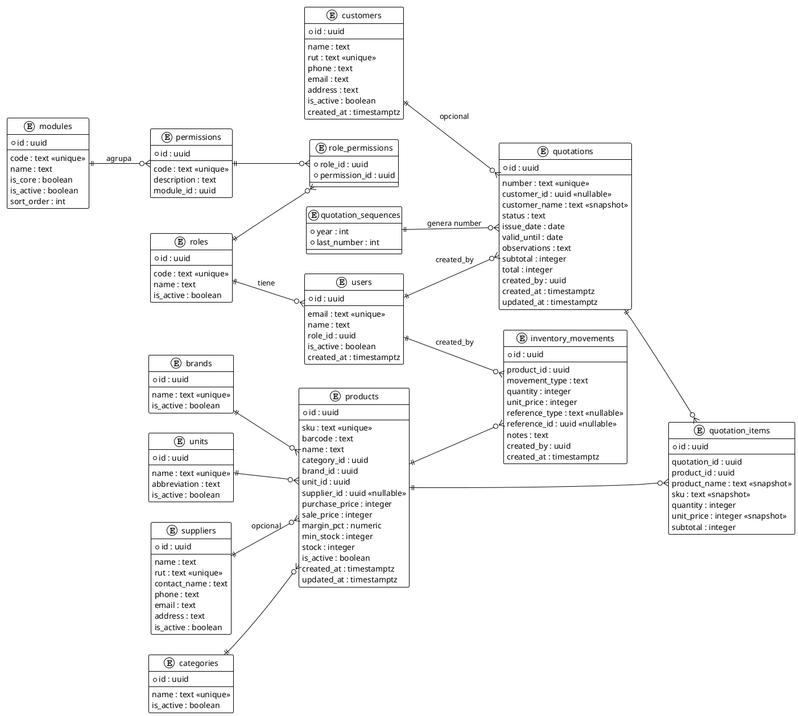

# ARQUITECTURA DEFINITIVA FINAL — ALMACÉN PEUMAYEN

> **Documento vigente.** Reemplaza por completo cualquier versión anterior de la arquitectura.
>
> | Campo | Valor |
> |---|---|
> | Proyecto | Sistema Modular de Gestión — Almacén Peumayen |
> | Tipo de documento | Arquitectura Definitiva Final (versión consolidada) |
> | Estado | **EN REVISIÓN HUMANA** — pendiente aprobación final para iniciar implementación |
> | Arquitectura | Monolito Modular + API REST + PostgreSQL |
> | Idioma / Región | Español — Chile (CLP, fechas DD/MM/YYYY) |
> | Alcance | MVP: Productos, Inventario, Clientes, Cotizaciones, Configuración |

---

## 0. CONTEXTO Y OBJETIVO DEL PROYECTO

**Almacén Peumayen** es un negocio de abarrotes y productos de consumo cotidiano. El proyecto consiste en construir un sistema web profesional que resuelva primero las necesidades reales:

- Gestión de productos, inventario, control de stock, precios.
- Clientes, cotizaciones, configuración del negocio.

Y que crezca después hacia: ventas, POS, lector de código de barras, comprobantes, impresora térmica, caja, compras y reportes avanzados.

### Prioridad absoluta

Un sistema **profesional, seguro, mantenible, Mobile First, modular, escalable razonablemente y sin sobreingeniería**, con una base sólida que permita evolucionar sin rehacer la arquitectura.

### Principios rectores del proyecto

1. **CORRECTITUD > COMPLACENCIA**
2. **INTEGRIDAD DE DATOS > CONVENIENCIA**
3. **CALIDAD > VELOCIDAD**
4. **SIMPLICIDAD > SOBREINGENIERÍA**
5. **MOBILE FIRST > DESKTOP ADAPTADO**

---

## PARTE A — LOS 24 PUNTOS DE LA ARQUITECTURA

---

## 1. ARQUITECTURA GENERAL

**Decisión aprobada: Monolito Modular + API REST + PostgreSQL.**

- **Monolito modular**: un solo backend desplegado como una unidad, organizado internamente por módulos de negocio (products, inventory, customers, quotations, config). No microservicios.
- **API REST** versionada bajo `/api/v1`.
- **PostgreSQL** como única fuente de verdad (Supabase PostgreSQL).
- **Supabase** aporta únicamente: Auth (identidad/tokens), Storage (archivos) y el motor PostgreSQL. **Toda la lógica de negocio vive en el backend Express con `pg`.**

### Diagrama de capas

```text
┌────────────────────────────────────────────────────────────────┐
│                          CLIENTE (React SPA)                    │
│   Vite · React · React Router · Axios · Mobile First           │
│   Tema Light/Dark/System · Formato es-CL (CLP, DD/MM/YYYY)     │
└───────────────┬────────────────────────────────────────────────┘
                │ HTTPS — JSON — /api/v1/...  (Bearer token Supabase)
┌───────────────▼────────────────────────────────────────────────┐
│                   BACKEND (Node.js + Express)                   │
│   Middlewares: Helmet · CORS · Rate limit · Auth · Módulos      │
│               · Permisos · Validación · Errores                 │
│   Capas: routes → controllers → services → repositories         │
│   Reglas de negocio · Transacciones (BEGIN/COMMIT/ROLLBACK)     │
│   · SELECT FOR UPDATE · Numeración de cotizaciones             │
└───────┬─────────────────────────────┬──────────────────────────┘
        │ pg (SQL parametrizado)      │ Supabase Auth / Storage
┌───────▼───────────┐   ┌─────────────▼──────────────┐
│ PostgreSQL (Sup.) │   │ Supabase Auth + Storage     │
│ Esquema public    │   │ Identidad · Tokens · Logo   │
└───────────────────┘   └────────────────────────────┘
```

### Flujo de una petición

1. React (Axios) → `POST /api/v1/quotation` con `Authorization: Bearer <access_token>`.
2. Backend: Helmet, CORS, rate limit → **Auth** (valida el JWT de Supabase) → **Módulo** (¿está activo?) → **Permiso** (`quotations.create`) → **Validación** (zod) → Controller → Service.
3. Service ejecuta **transacción PostgreSQL** (bloqueos, movimientos, numeración).
4. Respuesta JSON estandarizada.

---

## 2. STACK TECNOLÓGICO

**Aprobado sin cambios. No se utilizarán simultáneamente Prisma, Sequelize ni Supabase Client para consultas.** El acceso a datos es exclusivamente `pg`.

| Capa | Tecnología | Responsabilidad |
|---|---|---|
| Frontend | React + Vite + JavaScript | UI, Mobile First, temas, estado de sesión |
| Enrutado | React Router | Navegación SPA |
| HTTP client | Axios | Consumo de la API `/api/v1` |
| Backend | Node.js + Express | API REST, reglas de negocio, autorización |
| Base de datos | Supabase PostgreSQL | Persistencia, constraints, índices, transacciones |
| Acceso a datos | `pg` (pool + SQL parametrizado) | Consultas y transacciones; **única vía a datos** |
| Autenticación | Supabase Auth | Login, sesión, tokens, refresh |
| Archivos | Supabase Storage | Logo del negocio y futuros archivos (imágenes de producto) |
| Validación | zod | Esquemas compartidos frontend/backend (contrato de API) |
| Migraciones | node-pg-migrate | Orden, versionado y rollback de esquema (SQL puro, sin ORM) |
| PDF | pdfmake (servidor) | PDF de cotizaciones (determinista, sin navegador) |
| Testing | Vitest + Testing Library + Supertest + **Playwright** | Unit, componentes, integración, E2E (una sola herramienta E2E) |
| Deploy | Vercel → Frontend · Render → Backend | Hosting y entorno |
| Repos | Git + GitHub | Control de versiones, CI, branch protection |

### Matriz de responsabilidades (regla de oro)

| Tecnología | Hace | NO hace |
|---|---|---|
| Supabase Auth | Login, sesión, tokens, refresh | No reemplaza permisos de negocio |
| Supabase Storage | Logo y archivos | No guarda datos de negocio |
| `pg` | Consultas y transacciones PostgreSQL | No autentica, no sube archivos |
| Express | Reglas de negocio y API | No guarda archivos, no emite JWT propio |

**Monorepo previsto** (referencial, se creará tras aprobación):

```text
almacen-peumayen/
├── frontend/     # React + Vite
├── backend/      # Express + pg
├── database/     # migraciones node-pg-migrate + seeds
├── e2e/          # Playwright
└── docs/         # este documento y otros
```

---

## 3. PRINCIPIOS DE DISEÑO

1. **Integridad de datos primero**: constraints en BD, transacciones, soft delete, precios históricos.
2. **Backend como única autoridad**: permisos, stock, signos y numeración se validan en servidor. El frontend nunca es la barrera de seguridad.
3. **Simplicidad > sobreingeniería**: una sola herramienta por responsabilidad (una ORM no, una librería E2E, un pool `pg`).
4. **Mobile First real**: smartphone → tablet → desktop (no adaptación tardía).
5. **Módulos como frontera**: cada módulo encapsula rutas, servicios y permisos; desactivar un módulo no destruye datos.
6. **Historia inalterable**: los documentos (cotizaciones) y movimientos nunca se reescriben ni eliminan físicamente.
7. **Sin magia**: sin triggers para stock, sin JWT propio, sin duplicidad de numeración. La lógica es explícita y testeable.

---

## 4. MOBILE FIRST (REQUISITO CRÍTICO)

El diseño se construye **desde el smartphone hacia arriba**:

```text
SMARTPHONE  →  TABLET  →  DESKTOP
```

### Reglas obligatorias

- **Navegación táctil**: bottom navigation o menú colapsable en móvil; áreas de toque ≥ 44 px.
- **Botones cómodos**: acciones primarias siempre accesibles con el pulgar.
- **Formularios verticales**: un campo por fila, inputs grandes, teclados adecuados (type numérico para precios/cantidades).
- **Legibilidad**: tipografía mínima legible, contraste AA, jerarquía clara.
- **Carga rápida**: bundles pequeños, lazy loading de rutas, imágenes optimizadas.
- **Responsive real**: se prueba en dispositivos reales y emuladores desde la primera iteración.

### Representación por pantalla (regla explícita)

**NO se convierten automáticamente todas las tablas en tarjetas.** Cada pantalla decide la representación más usable:

| Pantalla | Smartphone | Tablet / Desktop |
|---|---|---|
| Productos | Lista compacta + búsqueda | Tabla responsive con columnas configurables |
| Inventario (historial) | Timeline de movimientos | Tabla con filtros |
| Cotizaciones | Lista + vista previa | Lista con estados |
| Detalle de cotización | Vista previa legible | Vista previa + acciones |
| Clientes | Lista + búsqueda | Tabla |

La decisión es de **usabilidad**, no de una regla visual fija.

---

## 5. RESPONSIVE

- Breakpoints basados en contenido: `sm (640)`, `md (768)`, `lg (1024)`, `xl (1280)`.
- Grid fluido (CSS Grid/Flexbox) sin dependencias de UI pesadas.
- Probarse en: 360–414 px (smartphones), 768–834 px (tablets), 1280+ px (desktop).
- El layout del detalle de cotización y los formularios se diseñan primero en móvil; en desktop se reordenan (no se "comprime" un layout de escritorio).

---

## 6. DARK / LIGHT / SYSTEM

- Tres modos: **Light**, **Dark**, **System** (sigue `prefers-color-scheme`).
- **La preferencia persiste** (localStorage) y se aplica antes del render para evitar flash (`data-theme` en `<html>`, script inline en `index.html`).
- **Tokens de diseño** (CSS custom properties), nunca inversión automática de colores:

```text
--color-bg, --color-surface, --color-text, --color-text-muted,
--color-primary, --color-on-primary, --color-border,
--color-success, --color-warning, --color-danger,
--color-focus-ring, --radius-*, --space-*, --font-size-*
```

- Ambas paletas se **diseñan explícitamente** (contraste AA en dark, sin colores "quemados").
- Componentes de UI propios sobre los tokens (botones, inputs, tablas, modales, badges de estado).

---

## 7. UX / UI

- Idioma: **Español (Chile)**. Moneda **CLP**: `$1.500`, `$15.990`, `$1.250.000` — **sin decimales** (`Intl.NumberFormat('es-CL', { style: 'currency', currency: 'CLP', maximumFractionDigits: 0 })`).
- Fechas visibles: **`DD/MM/YYYY`** (ej.: `15/08/2026`) mediante `Intl.DateTimeFormat('es-CL')`.
- Almacenamiento interno: `timestamptz` (UTC) — **nunca** fechas como texto visual en BD.
- Zona horaria del negocio: `America/Santiago` (conversión en el frontend).
- Estados de documentos con badges de color consistentes (BORRADOR/ENVIADA/ACEPTADA/RECHAZADA/VENCIDA/CONVERTIDA_A_VENTA).
- Feedback claro: loading, errores con mensaje humano, confirmaciones destructivas, optimismo solo donde es seguro.
- Accesibilidad: foco visible, labels, aria, contraste, target táctil.

---

## 8. MODELO DE DATOS DEFINITIVO

### 8.1. Entidades del MVP (14 tablas)

| Tabla | Propósito |
|---|---|
| `users` | Perfil de usuario (id = `auth.users.id` de Supabase), rol, estado |
| `roles` | Catálogo de roles (MVP: ADMIN; futuro: MANAGER, SELLER, WAREHOUSE) |
| `permissions` | Catálogo de permisos granulares (`module.action`) |
| `role_permissions` | Asignación rol ↔ permiso |
| `modules` | Catálogo de módulos activables/desactivables (`is_core`, `is_active`) |
| `categories` | Categorías de productos |
| `brands` | Marcas de productos |
| `units` | Unidades de medida (unidad, kg, caja, etc.) |
| `suppliers` | Proveedores (**opcional** en producto) |
| `products` | Producto: SKU, barcode, precios, margen, stock mínimo, stock, `is_active` |
| `inventory_movements` | Historial completo de movimientos (entradas, salidas, ajustes) |
| `customers` | Clientes del negocio |
| `quotations` | Cotizaciones (número, cliente opcional, estados, vigencia, totales) |
| `quotation_items` | Ítems con **precios históricos** (nombre, SKU, precio, subtotal) |

**Además (nueva, obligatoria por la corrección A):**

| Tabla | Propósito |
|---|---|
| `quotation_sequences` | Secuencia atómica de numeración por año (`year`, `last_number`) |

### 8.2. Entidades preparadas conceptualmente (fases futuras, NO se crean en el MVP)

`sales`, `sale_items`, `payment_methods`, `cash_registers`, `purchases`, `purchase_items`.

> El diseño de `inventory_movements` (tipos `SALE`, `PURCHASE`) y `quotations.status = CONVERTIDA_A_VENTA` deja el terreno listo sin crear tablas hoy.

### 8.3. Reglas de negocio sobre el modelo

- `suppliers.supplier_id` en `products` es **opcional** (un producto puede existir sin proveedor).
- Multi-proveedor por producto: **evaluado para el futuro, NO implementado en el MVP**.
- **Soft delete**: los productos y clientes históricos **no se eliminan físicamente**; se usa `is_active = false`. Categorías, marcas, unidades y proveedores: desactivar en lugar de eliminar cuando existan relaciones históricas.
- Las relaciones históricas preservan integridad (FK con `ON DELETE RESTRICT`).
- **Precios históricos**: toda cotización conserva nombre del producto, SKU, precio unitario y subtotal como **snapshot**. Si el producto cambia de precio o nombre después, los documentos históricos **no se modifican**.

---

## 9. DIAGRAMA ENTIDAD-RELACIÓN

### 9.1. Diagrama simplificado (legible en cualquier visor de Markdown)

```text
roles ──< users
roles ──< role_permissions >── permissions ──< modules

categories ──< products >── brands
units ───────< products >── suppliers (opcional)

products ──< inventory_movements >── (created_by) users
customers ──< quotations >── (created_by) users
quotations ──< quotation_items >── products
quotation_sequences ── genera ── quotations.number
```

### 9.2. Diagrama formal (PlantUML, para generar imagen con cualquier renderizador)



---

## 10. RELACIONES

| Desde | Hacia | Cardinalidad | Nulable | `ON DELETE` | Notas |
|---|---|---|---|---|---|
| `users.role_id` | `roles.id` | N:1 | No | RESTRICT | Un rol por usuario |
| `role_permissions.role_id` | `roles.id` | N:1 | No | CASCADE | PK compuesta `(role_id, permission_id)` |
| `role_permissions.permission_id` | `permissions.id` | N:1 | No | CASCADE | |
| `permissions.module_id` | `modules.id` | N:1 | No | RESTRICT | Módulo no eliminable si tiene permisos |
| `products.category_id` | `categories.id` | N:1 | No | RESTRICT | Categoría se desactiva, no se borra |
| `products.brand_id` | `brands.id` | N:1 | No | RESTRICT | |
| `products.unit_id` | `units.id` | N:1 | No | RESTRICT | |
| `products.supplier_id` | `suppliers.id` | N:1 | **Sí** | RESTRICT | Producto puede no tener proveedor |
| `inventory_movements.product_id` | `products.id` | N:1 | No | RESTRICT | Historial nunca se rompe |
| `inventory_movements.created_by` | `users.id` | N:1 | No | RESTRICT | Trazabilidad del operador |
| `quotations.customer_id` | `customers.id` | N:1 | **Sí** | RESTRICT | Cotización sin cliente permitida |
| `quotations.created_by` | `users.id` | N:1 | No | RESTRICT | |
| `quotation_items.quotation_id` | `quotations.id` | N:1 | No | CASCADE | Ítems viven con su cotización |
| `quotation_items.product_id` | `products.id` | N:1 | No | RESTRICT | Productos nunca se eliminan físicamente |

**Reglas transversales**

- `users.id` = `auth.users.id` (Supabase Auth). La tabla `users` es un perfil de negocio, no una tabla de credenciales.
- Ninguna FK que apunte a un registro histórico usa `SET NULL` salvo `supplier_id` y `customer_id`, que son **opcionalidad de negocio**, no pérdida de integridad.
- Los snapshots (`product_name`, `sku`, `unit_price`, `customer_name`) garantizan que el documento histórico no dependa del estado actual del catálogo.

---

## 11. ORDEN CORRECTO DE MIGRACIONES

Orden estricto por dependencias (cada migración es atómica; `node-pg-migrate` garantiza orden y rollback):

| # | Migración | Contenido | Depende de |
|---|---|---|---|
| 1 | `0001_extension` | `pgcrypto` (`gen_random_uuid()`), `citext` (emails), `pg_trgm` (búsquedas) | — |
| 2 | `0002_roles` | Tabla `roles` + seed básico | — |
| 3 | `0003_modules` | Tabla `modules` + seed de catálogo | — |
| 4 | `0004_permissions` | Tabla `permissions` | `modules` |
| 5 | `0005_role_permissions` | Tabla `role_permissions` + seed ADMIN con todos los permisos | `roles`, `permissions` |
| 6 | `0006_users` | Tabla `users` (perfil) | `roles` |
| 7 | `0007_categories_brands_units` | Tablas de catálogo + seeds base (unidades típicas) | — |
| 8 | `0008_suppliers` | Tabla `suppliers` | — |
| 9 | `0009_products` | Tabla `products` | catálogos + `suppliers` |
| 10 | `0010_inventory_movements` | Tabla `inventory_movements` | `products`, `users` |
| 11 | `0011_customers` | Tabla `customers` | — |
| 12 | `0012_quotation_sequences` | Tabla `quotation_sequences` | — |
| 13 | `0013_quotations` | Tabla `quotations` | `customers`, `users`, `quotation_sequences` |
| 14 | `0014_quotation_items` | Tabla `quotation_items` | `quotations`, `products` |
| 15 | `0015_constraints_indexes` | Constraints adicionales e índices (puntos 12 y 13) | todas |
| 16 | `0016_seed_admin` | Bootstrap del primer ADMIN (usuario Supabase + perfil + config inicial) | todas |

Reglas:
- Los seeds de **catálogo** (módulos, permisos, roles) son idempotentes (`ON CONFLICT DO NOTHING`).
- La migración 16 es el único punto de creación del primer usuario; el registro público está **deshabilitado** en el MVP.
- Las tablas futuras (`sales`, etc.) se agregarán como migraciones nuevas, nunca editando las históricas.

---

## 12. CONSTRAINTS

**Decisión: la base de datos es la última barrera de integridad.** Constraints + validaciones en backend.

| Tabla | Constraint |
|---|---|
| `products` | `CHECK (stock >= 0)` — **no stock negativo** (red de seguridad) |
| `products` | `CHECK (purchase_price >= 0 AND sale_price >= 0 AND min_stock >= 0)` |
| `products` | `UNIQUE (sku)`; `UNIQUE` parcial sobre `barcode` donde no es nulo |
| `inventory_movements` | `CHECK (quantity > 0)` — **cantidad siempre positiva** |
| `inventory_movements` | `CHECK (movement_type IN ('PURCHASE','RETURN','SALE','ADJUSTMENT_IN','ADJUSTMENT_OUT'))` |
| `inventory_movements` | `CHECK (unit_price >= 0)` |
| `quotations` | `CHECK (status IN ('BORRADOR','ENVIADA','ACEPTADA','RECHAZADA','VENCIDA','CONVERTIDA_A_VENTA'))` |
| `quotations` | `CHECK (subtotal >= 0 AND total >= 0)`; `CHECK (valid_until >= issue_date)` |
| `quotation_items` | `CHECK (quantity > 0 AND unit_price >= 0)`; `CHECK (subtotal = quantity * unit_price)` |
| `quotation_sequences` | `PRIMARY KEY (year)`; `CHECK (last_number >= 0)` |
| `users` | `UNIQUE (email)`; `role_id NOT NULL` |
| `role_permissions` | `PRIMARY KEY (role_id, permission_id)` |
| `customers` / `suppliers` | `UNIQUE (rut)` (nullable con índice parcial) |
| `modules` | `UNIQUE (code)` |
| `permissions` | `UNIQUE (code)` |

**Nota sobre stock negativo**: además del `CHECK`, el backend valida la operación **antes** de escribir (flujo del punto 16). El `CHECK` existe como última barrera, no como mecanismo principal.

---

## 13. ÍNDICES

Índices por consulta real (se evita indexar por indexar):

| Índice | Tabla | Columnas | Propósito |
|---|---|---|---|
| `products_sku_uq` | products | `sku` (único) | Lookup exacto por SKU |
| `products_barcode_uq_partial` | products | `barcode` (único parcial) | Búsqueda por código de barras (MVP: dato; futuro: lector) |
| `products_name_trgm` | products | `name` (GIN `pg_trgm`) | Búsqueda difusa (abarrotes: nombres variados) |
| `products_category_idx` | products | `category_id` | Filtro por categoría |
| `products_is_active_idx` | products | `is_active` | Listados activos |
| `movements_product_created_idx` | inventory_movements | `(product_id, created_at DESC)` | Historial por producto (timeline) |
| `movements_type_idx` | inventory_movements | `movement_type` | Filtro por tipo |
| `movements_ref_idx` | inventory_movements | `(reference_type, reference_id)` | Trazabilidad (ej. cotización→venta futura) |
| `quotations_number_uq` | quotations | `number` (único) | Numeración, búsqueda |
| `quotations_customer_idx` | quotations | `customer_id` | Cotizaciones por cliente |
| `quotations_status_idx` | quotations | `status` | Filtro por estado |
| `quotations_issue_idx` | quotations | `issue_date` | Rangos de fecha |
| `qitems_quotation_idx` | quotation_items | `quotation_id` | Carga de detalle |
| `customers_name_trgm` | customers | `name` (GIN) | Búsqueda de clientes |
| `customers_rut_uq` | customers | `rut` (único parcial) | Lookup RUT |
| `users_email_uq` | users | `email` (único) | Perfil por email |

---

## 14. ESTRATEGIA DE INVENTARIO

**Aprobada SIN triggers.**

- `inventory_movements` = **historial completo** (auditoría total).
- `products.stock` = **valor operativo actual** (derivable, mantenido por el backend).
- Toda modificación de stock genera un movimiento.
- Las operaciones críticas usan **transacciones PostgreSQL** con `SELECT ... FOR UPDATE`.
- **NO hay triggers automáticos** para actualizar stock. La lógica vive en el backend con `pg`.

### Regla de cantidades (sin ambigüedad)

**`quantity` se almacena siempre como número positivo.** El efecto depende del tipo de movimiento. **El signo se aplica únicamente en el backend.**

| Tipo | Quantity | Efecto |
|---|--:|---|
| `PURCHASE` | 10 | +10 |
| `RETURN` | 5 | +5 |
| `SALE` | 3 | −3 |
| `ADJUSTMENT_IN` | 8 | +8 |
| `ADJUSTMENT_OUT` | 2 | −2 |

- El frontend **nunca envía cantidades negativas**.
- El backend traduce el tipo al signo (tabla interna `signMap`).
- `ADJUSTMENT_IN` y `ADJUSTMENT_OUT` son los únicos tipos de ajuste en el MVP; un ajuste "a cero" se compone de dos movimientos si es necesario.

### Stock negativo

**MVP: NO se permite stock negativo.** Doble barrera: validación en backend (antes de escribir) + `CHECK (stock >= 0)` en BD.

> Extensión opcional documentada (no implementada): tipo `INITIAL` para carga inicial de stock al activar el sistema, con cantidad positiva y efecto +.

### Alertas de stock

- `products.min_stock` + consulta `stock <= min_stock AND is_active` → alertas en UI (badge y listado).
- No hay notificaciones push en el MVP (documentado como mejora futura).

---

## 15. TRANSACCIONES CON `pg`

Toda operación que modifica stock o numeración se ejecuta dentro de una transacción explícita con `pg` (Pool + cliente dedicado). El backend expone un helper `withTransaction(async (client) => {...})` que hace `BEGIN`, ejecuta, `COMMIT`, y hace `ROLLBACK` ante cualquier error.

### Flujo obligatorio (regla del proyecto)

```text
BEGIN
  ↓
  bloquear producto
  SELECT ... FOR UPDATE
  ↓
  obtener stock actual
  ↓
  validar operación (¿stock suficiente? ¿cantidad > 0?)
  ↓
  crear movimiento (quantity positiva, tipo con signo en backend)
  ↓
  actualizar products.stock
  ↓
  confirmar
COMMIT

Si algo falla:
ROLLBACK
```

### Reglas de implementación

- SQL **siempre parametrizado** (prepared statements de `pg`, sin interpolación de strings).
- El error del driver se captura; si es de concurrencia (`40P01` deadlock / `40001` serialización) se reintenta con límite (punto 17).
- Ningún `COMMIT` parcial: todo o nada.
- Los repositorios reciben el `client` transaccional; los servicios orquestan.

---

## 16. SELECT ... FOR UPDATE

**Propósito**: evitar carreras cuando dos peticiones modifican el mismo producto o el mismo año de secuencia.

### Uso correcto (patrón)

```text
1. BEGIN
2. SELECT stock FROM products WHERE id = $1 FOR UPDATE   -- bloquea la fila
3. Se lee el stock ya bloqueado (ningún otro escritor puede modificarlo)
4. Validación de negocio (suficiente stock, operación permitida)
5. INSERT INTO inventory_movements ...
6. UPDATE products SET stock = stock + $efecto WHERE id = $1
7. COMMIT
```

- El lock dura hasta `COMMIT`/`ROLLBACK`.
- Los lectores concurrentes que no escriben no se bloquean (lectura consistente sin espera).
- **Orden de bloqueo consistente** (p. ej., siempre producto por `id` ascendente) para minimizar deadlocks.

### Numeración de cotizaciones

El mismo patrón se aplica a `quotation_sequences` (punto 23): la fila `(year, ...)` se bloquea con `FOR UPDATE` antes de leer `last_number`.

---

## 17. ESTRATEGIA DE CONCURRENCIA

| Riesgo | Mecanismo |
|---|---|
| Dos ventas/ajustes sobre el mismo producto | `SELECT ... FOR UPDATE` sobre `products` dentro de la transacción |
| Dos cotizaciones en el mismo año | `SELECT ... FOR UPDATE` sobre `quotation_sequences (year)` (numeración atómica) |
| Deadlocks (`40P01`) / serialización (`40001`) | Reintento automático hasta 3 veces con backoff exponencial + jitter |
| Duplicados residuales | Constraints `UNIQUE` como barrera final (ej. `number` único) |
| Lecturas inconsistentes | Todo el flujo crítico dentro de una única transacción |

- Nivel de aislamiento: `READ COMMITTED` (default) es suficiente con los bloqueos de fila; `REPEATABLE READ` queda documentado como opción si el futuro lo exige (no se usa en el MVP).
- Alternativa documentada (no implementada): `pg_advisory_xact_lock` para la secuencia anual si se detectara contención — no necesaria en el MVP por volumen esperado.

---

## 18. ROLES Y PERMISOS

### Modelo

- `roles` → `role_permissions` → `permissions` (códigos granulares) → `modules`.
- **MVP: solo `ADMIN`** (seed con todos los permisos). Tablas y catálogos **preparados** para `MANAGER`, `SELLER`, `WAREHOUSE`.

### Separación módulo / permiso

- **Módulo** = dominio (ej.: `quotations`).
- **Permiso** = acción granular `module.action` (ej.: `quotations.create`, `quotations.read`, `quotations.update`, `quotations.delete`, `quotations.convert`).

### Catálogo de permisos MVP

| Módulo | Permisos |
|---|---|
| products | `products.create`, `products.read`, `products.update`, `products.delete` (desactivar) |
| categories / brands / units / suppliers | `*.create`, `*.read`, `*.update`, `*.delete` (desactivar) |
| inventory | `inventory.read`, `inventory.create_movement`, `inventory.adjust`, `inventory.view_history` |
| customers | `customers.create`, `customers.read`, `customers.update`, `customers.delete` (desactivar) |
| quotations | `quotations.create`, `quotations.read`, `quotations.update`, `quotations.delete`, `quotations.convert` (futuro), `quotations.export_pdf` |
| config | `config.read`, `config.update` |
| modules | `modules.read`, `modules.update` (activar/desactivar módulos) |

### Regla de oro

**El backend es siempre responsable de validar permisos.** El frontend solo oculta botones por UX; nunca confiar únicamente en React.

Flujo del middleware de autorización:

```text
Request → Auth (JWT Supabase válido) → obtener user_id
        → cargar rol del usuario (tabla users)
        → cargar permisos del rol (role_permissions JOIN permissions)
        → ¿existe el permiso requerido por la ruta? Sí → next() | No → 403
```

- RLS en PostgreSQL se define como **defensa en profundidad** (documentado en punto 20), pero la autorización efectiva es la del backend, porque el acceso vía `pg` (superusuario/service role de Supabase) la atraviesa.

---

## 19. MÓDULOS ACTIVABLES

**Decisión: el sistema es para un único negocio (Peumayen). NO hay multiempresa ni multi-tenancy en el MVP.**

- Tabla `modules` como **catálogo** con `is_core` e `is_active` para esta instalación.

### Módulos

| Módulo | Estado | Core |
|---|---|---|
| products (Productos) | **Activo MVP** | No |
| inventory (Inventario) | **Activo MVP** | No |
| customers (Clientes) | **Activo MVP** | No |
| quotations (Cotizaciones) | **Activo MVP** | No |
| config (Configuración) | **Activo MVP** | **Sí** (no desactivable) |
| modules (Módulos) | Activo | **Sí** (no desactivable) |
| sales (Ventas) | Futuro | No |
| pos (POS) | Futuro | No |
| cash (Caja) | Futuro | No |
| purchases (Compras) | Futuro | No |
| reports (Reportes) | Futuro | No |

### Efectos de desactivar un módulo

1. **NO elimina datos** (conserva toda la información).
2. Oculta la navegación en el frontend.
3. **Bloquea endpoints** (middleware de módulos en backend → `404`/`403`).
4. Impide operaciones (no solo se oculta el botón).

### Regla de dependencias

Un módulo **no puede desactivarse si otro módulo activo depende de él** (ej.: `quotations` depende de `products` y `customers`). El backend valida la dependencia antes de permitir el cambio.

### Evolución futura (documentada, NO implementada)

Si algún día hubiera múltiples negocios: agregar columna `business_id` a las tablas de negocio, una tabla `businesses`, y filtrar por ella; los `modules` pasarían a ser `business_modules`. Los permisos, numeración y estructura actual no impiden esa evolución, pero **no se construye nada de eso ahora**.

---

## 20. AUTENTICACIÓN CON SUPABASE AUTH

**Decisión: Supabase Auth es el ÚNICO sistema de autenticación.** No se crea JWT propio, no se agrega `JWT_SECRET` ni librerías de sesión caseras.

### Flujo

1. Login (email + password) contra Supabase Auth → `access_token` + `refresh_token`.
2. El frontend envía `Authorization: Bearer <access_token>` en cada request.
3. El backend valida el token **en cada request** (`supabase.auth.getUser(token)` con credenciales anónimas del proyecto — el `service_role` es **solo servidor** y se usa para operaciones administrativas puntuales).
4. La sesión se refresca automáticamente con Supabase (rotación de refresh token).

### Comparación de estrategias de sesión en React

| Estrategia | Ventajas | Desventajas | Veredicto |
|---|---|---|---|
| `localStorage` | Persistente entre pestañas/reinicios; es el mecanismo por defecto de `supabase-js` | Exposición a XSS (pero mitigable con CSP y buenas prácticas) | **ELEGIDA** |
| `sessionStorage` | Se limpia al cerrar la pestaña | Pierde sesión al cerrar pestaña; UX pobre en móvil | Rechazada |
| Cookies HttpOnly | Máxima protección contra XSS (JS no lee la cookie) | Requiere endpoints propios de set/refresh y protección CSRF; más complejo en SPA sin SSR | Documentada como mejora futura opcional |
| Oficial Supabase (SPA) | `supabase-js` con persistencia `localStorage` + refresh automático + `detectSessionInUrl` | — | Alineada con la elección |

### Decisión justificada

**`supabase-js` con persistencia en `localStorage` + refresh automático + validación del token en cada request del backend.**

Razones:
1. **Simplicidad**: es el mecanismo oficial para SPA; sin SSR no se justifica la complejidad de cookies.
2. **Seguridad suficiente y verificable**: el backend **nunca confía** en el token sin verificarlo; un token robado caduca (expiración + refresh rotation).
3. Sin CSRF (se usa header `Authorization`, no cookies).
4. XSS se mitiga con: CSP estricta, cero `dangerouslySetInnerHTML`, sanitización, dependencias auditadas.
5. El login/logout son funciones nativas de Supabase Auth.

### Bootstrap del primer usuario (MVP)

- Registro público **deshabilitado**.
- El primer ADMIN se crea en la migración `0016_seed_admin` (usuario en Supabase Auth + perfil en `users` + rol ADMIN).
- La creación de nuevos usuarios (con rol) será funcionalidad del ADMIN, en una fase posterior.

### Variables de entorno

| Variable | Dónde | Uso |
|---|---|---|
| `DATABASE_URL` | Backend (Render) | Pool `pg` (connection string del pooler de Supabase) |
| `SUPABASE_URL` | Backend y frontend (`VITE_`) | Proyecto |
| `SUPABASE_ANON_KEY` | Backend y frontend (`VITE_`) | Validación de token / cliente público |
| `SUPABASE_SERVICE_ROLE_KEY` | **Solo backend** | Operaciones administrativas puntuales (nunca en frontend) |
| `FRONTEND_URL` | Backend | CORS whitelist |
| `PORT` / `NODE_ENV` | Backend | Runtime |

---

## 21. STORAGE Y POLÍTICAS

**Corrección aplicada**: la versión anterior declaraba "solo ADMIN sube el logo" pero la política permitía a cualquier usuario autenticado. **Corregido y consistente.**

### Diseño

- **Bucket**: `company-assets` (público de lectura — el logo aparece en UI y PDFs).
- **Ruta del logo**: `logo/logo.png`.
- Futuro: `products/` para imágenes de producto (mismas políticas).

### Políticas (definitivas)

| Operación | RLS (`storage.objects`) | Quién |
|---|---|---|
| Lectura (SELECT) | `true` | Público (cualquiera, incluso no autenticado) |
| Subida (INSERT) | `public.app_is_admin()` | Solo ADMIN |
| Reemplazo (UPDATE) | `public.app_is_admin()` | Solo ADMIN |
| Eliminación (DELETE) | `public.app_is_admin()` | Solo ADMIN |

### Cómo se valida ADMIN dentro de RLS

Una política RLS puede consultar otras tablas, pero hacerlo directamente desde la política sobre `storage.objects` → `users` → RLS produce **recursión**. La solución estándar (y la elegida):

```sql
-- Función SECURITY DEFINER: se ejecuta con privilegios del definidor
-- y NO activa RLS de public.users (evita recursión).
create function public.app_is_admin()
returns boolean
language sql
stable
security definer
set search_path = public
as $$
  select exists (
    select 1
    from public.users u
    join public.roles r on r.id = u.role_id
    where u.id = auth.uid()
      and r.code = 'ADMIN'
      and u.is_active = true
  );
$$;
```

- `auth.uid()` = id del usuario autenticado (proporcionado por Supabase Auth dentro de RLS).
- `SECURITY DEFINER` + `set search_path = public` evita la recursión RLS y el riesgo de path hijacking.
- El backend **además** valida ADMIN en el código (autorización en capa de aplicación) — RLS es defensa en profundidad.

---

## 22. API REST — `/api/v1`

**Estandarización obligatoria**: todos los endpoints bajo `/api/v1/...` con prefijo consistente. **No se mezcla `/api/` con `/api/v1/`.**

### Prefijos

```text
/api/v1/auth         /api/v1/products      /api/v1/categories
/api/v1/brands       /api/v1/units         /api/v1/suppliers
/api/v1/inventory    /api/v1/customers     /api/v1/quotations
/api/v1/modules      /api/v1/config        /api/v1/storage
/api/v1/health
```

### Convenciones

- Verbos REST: `GET` (leer/listar), `POST` (crear), `PUT/PATCH` (actualizar), `DELETE` (desactivar/eliminar lógico).
- `DELETE` sobre entidades con historial = **desactivación** (`is_active = false`), nunca borrado físico.
- **Envelope de respuesta**:

```json
{ "data": { }, "meta": { "page": 1, "per_page": 25, "total": 120 }, "error": null }
{ "data": null, "meta": null, "error": { "code": "PERMISSION_DENIED", "message": "..." } }
```

- Paginación: `?page=1&per_page=25` (para movimientos, cursor por `created_at` cuando aplique).
- Filtros: `?q=`, `?is_active=`, `?category_id=`, `?status=`, `?from=&to=` (fechas ISO).
- Orden: `?sort=name&order=asc`.
- Errores HTTP coherentes: `400` validación, `401` no autenticado, `403` sin permiso/módulo inactivo, `404` no existe, `409` conflicto (ej. stock insuficiente), `429` rate limit, `500` error interno **sin stack traces**.

### Endpoints principales (referencia)

| Método | Ruta | Permiso | Notas |
|---|---|---|---|
| POST | `/api/v1/auth/login` | — | Login Supabase (o uso directo de `supabase-js` desde el frontend) |
| POST | `/api/v1/auth/logout` | autenticado | Cierre de sesión |
| GET | `/api/v1/auth/me` | autenticado | Usuario + rol + permisos (sesión) |
| GET/POST | `/api/v1/products` | `products.read/create` | Listar con filtros / crear |
| GET/PUT | `/api/v1/products/:id` | `products.read/update` | Detalle / actualizar |
| DELETE | `/api/v1/products/:id` | `products.delete` | Desactivar (`is_active=false`) |
| GET/POST | `/api/v1/categories`, `/brands`, `/units`, `/suppliers` | `*.read/create` | Catálogos |
| PUT/DELETE | `/api/v1/categories/:id`, ... | `*.update/delete` | Actualizar / desactivar |
| GET | `/api/v1/inventory` | `inventory.read` | Stock actual (con alertas) |
| GET | `/api/v1/inventory/products/:id/movements` | `inventory.view_history` | Historial/trazabilidad |
| POST | `/api/v1/inventory/movements` | `inventory.create_movement` | Entrada/salida/ajuste (transaccional) |
| GET/POST | `/api/v1/customers` | `customers.read/create` | Listar (con búsqueda) / crear |
| PUT/DELETE | `/api/v1/customers/:id` | `customers.update/delete` | Editar / desactivar |
| GET/POST | `/api/v1/quotations` | `quotations.read/create` | Listar / crear (numeración atómica) |
| GET/PUT | `/api/v1/quotations/:id` | `quotations.read/update` | Detalle / editar (solo BORRADOR) |
| POST | `/api/v1/quotations/:id/status` | `quotations.update` | Transición de estado |
| GET | `/api/v1/quotations/:id/pdf` | `quotations.export_pdf` | Descargar PDF |
| GET/PUT | `/api/v1/modules` | `modules.read/update` | Estado de módulos |
| GET/PUT | `/api/v1/config` | `config.read/update` | Configuración del negocio (nombre, logo, etc.) |
| POST | `/api/v1/storage/logo` | `config.update` | Subir/reemplazar logo |
| GET | `/api/v1/health` | — | Healthcheck (Render) |

### Orden de middlewares (por petición)

```text
Helmet → CORS (whitelist) → Rate limit → express.json({ limit }) → Auth (Supabase JWT)
→ Módulo activo → Permiso requerido → Validación (zod) → Controller/Service → Error handler
```

---

## 23. COTIZACIONES

### 23.1. Estados

| Estado | Significado |
|---|---|
| `BORRADOR` | En edición (único estado editable) |
| `ENVIADA` | Enviada al cliente |
| `ACEPTADA` | Aceptada por el cliente |
| `RECHAZADA` | Rechazada |
| `VENCIDA` | `valid_until` superado sin aceptación |
| `CONVERTIDA_A_VENTA` | Convertida en venta (fase futura) |

### 23.2. Regla principal (stock)

- **Crear una cotización: NO modifica stock.**
- **Aceptar una cotización: NO modifica stock.**
- **Solo cuando exista el módulo de ventas** y la cotización se convierta en venta:

```text
1. Validar stock
2. Crear venta
3. Crear detalle (reutiliza productos y cantidades de la cotización)
4. Registrar movimiento de inventario
5. Actualizar inventario
6. Marcar cotización como CONVERTIDA_A_VENTA
```

Todo dentro de una única transacción (puntos 15–17). La conversión reutiliza automáticamente los productos y cantidades del detalle de la cotización.

### 23.3. Numeración (corrección A — atómica)

**NO se usa `MAX(numero) + 1`** (duplicados bajo concurrencia). Se usa la tabla `quotation_sequences`:

```text
quotation_sequences
├── year         (PK)   → 2026
└── last_number         → 3
```

Algoritmo (dentro de la misma transacción de creación):

```text
BEGIN
  -- 1. Bloquear la fila del año (si no existe, insertar con last_number = 0)
  INSERT INTO quotation_sequences (year, last_number)
  VALUES ($año, 0)
  ON CONFLICT (year) DO NOTHING;

  SELECT last_number FROM quotation_sequences WHERE year = $año FOR UPDATE;

  -- 2. Incrementar y construir el número
  new_number := last_number + 1;
  UPDATE quotation_sequences SET last_number = new_number WHERE year = $año;

  -- 3. number = 'COT-' || $año || '-' || LPAD(new_number, 4, '0')
  --    → COT-2026-0001, COT-2026-0002, COT-2026-0003 ...
  -- 4. Crear la cotización con ese number
COMMIT
```

- **Reinicio automático por año** (la clave es `year`).
- Seguro por transacción + `FOR UPDATE` + `UNIQUE (number)` como barrera final.
- El frontend jamás genera el número.

### 23.4. Precios históricos (snapshots)

Cada ítem guarda: `product_name`, `sku`, `unit_price`, `subtotal` (copias en el momento de la cotización). Si el producto cambia de precio/nombre después, el documento **no cambia**. Se agrega además `customer_name` como snapshot (el cliente puede desactivarse o renombrarse).

### 23.5. Cliente opcional

- `customer_id` nullable: se puede cotizar sin cliente (venta mostrador futura).
- Los totales no dependen del cliente.

### 23.6. Vigencia y vencimiento

- `issue_date` (fecha de emisión) y `valid_until` (vigencia, ejemplo: 7 días).
- El estado `VENCIDA` se materializa de forma **perezosa** (al listar/detallar se marca `BORRADOR`/`ENVIADA` con `valid_until < hoy`) y, opcionalmente, por un **job diario** (`node-cron`) — sin triggers. Consistente con la estrategia "sin magia".
- Si una cotización vencida se quiere reutilizar: se crea una nueva (nunca se revive una vencida).

### 23.7. Edición y transiciones

| Transición | Permitida |
|---|---|
| BORRADOR → ENVIADA | Sí (envío manual) |
| ENVIADA → ACEPTADA / RECHAZADA / VENCIDA | Sí |
| ACEPTADA → CONVERTIDA_A_VENTA | Solo con módulo ventas (futuro) |
| Editar ítems | Solo en BORRADOR |

### 23.8. Vista previa, PDF, descarga e impresión

- **Vista previa**: HTML responsivo (Mobile First) con formato CLP y `DD/MM/YYYY`.
- **PDF**: generado en el **servidor** con `pdfmake` (determinista, misma tipografía y formato en todos los dispositivos) → endpoint `GET /api/v1/quotations/:id/pdf`.
- **Descargar / imprimir**: PDF descargable + impresión del navegador con CSS `@media print` optimizado.
- El PDF incluye: número, fechas, vigencia, datos del negocio (config), datos del cliente (si existe), tabla de ítems (nombre, SKU, cantidad, precio unitario, subtotal), observaciones, subtotal y total en CLP.

---

## 24. MVP + ROADMAP + RIESGOS TÉCNICOS + CHECKLIST DE APROBACIÓN

### 24.1. MVP definitivo

**CORE**: Login · Logout · Sesión · Usuario · Rol ADMIN · Configuración · Tema (Light/Dark/System) · Módulos.

**PRODUCTOS**: CRUD · Categorías · Marcas · Unidades · SKU · campo Barcode · Precio compra · Precio venta · Margen calculado · Stock mínimo · Activación/desactivación.

**INVENTARIO**: Stock · Entradas · Salidas · Ajustes · Historial · Alertas · Trazabilidad.

**CLIENTES**: Crear · Editar · Buscar · Desactivar.

**COTIZACIONES**: Crear · Editar (BORRADOR) · Estados · Cliente opcional · Productos · Cantidades · Precios históricos · Observaciones · Vigencia · Vista previa · PDF · Descargar · Imprimir.

**UX**: Mobile First · Responsive · Light · Dark · System.

### 24.2. Código de barras — separación de conceptos

| Momento | Alcance |
|---|---|
| **MVP** | Campo `barcode` (dato) · Campo `sku` · Búsqueda por barcode · Búsqueda por SKU |
| **Futuro** | Lector USB · Lector Bluetooth · Cámara móvil · Escaneo continuo · POS · Impresora térmica |

> **El dato existe desde el MVP. El hardware no.**

### 24.3. Fuera del MVP (NO implementar todavía)

POS · Ventas completas · Caja · Impresora térmica · Lector físico · Facturación electrónica · Compras avanzadas · Reportes avanzados · Multiempresa.

### 24.4. Roadmap de 10 semanas (ESTIMACIÓN, no plazo rígido)

Prioridad: **1) Integridad de datos · 2) Seguridad · 3) Calidad · 4) UX · 5) Funcionalidad · 6) Tiempo**. Si una fase requiere más tiempo, se extiende. El roadmap es una guía, no una obligación contractual.

| Semana | Fase | Entregable / Criterio de salida |
|---|---|---|
| 1 | Setup | Repos, CI básico, Supabase (DB/Auth/Storage), migraciones 1–16 ejecutadas, bootstrap ADMIN, healthcheck |
| 2 | Auth + Shell | Login/logout/sesión, layout Mobile First, tema Light/Dark/System persistente, configuración básica |
| 3 | Catálogo | Categorías, marcas, unidades, proveedores (CRUD + desactivar) |
| 4 | Productos | CRUD completo: SKU, barcode, precios, margen calculado, stock mínimo, activar/desactivar, búsquedas |
| 5 | Inventario | Entradas, salidas, ajustes, historial/trazabilidad, alertas de stock — todo transaccional |
| 6 | Clientes | CRUD + búsqueda + desactivar |
| 7 | Cotizaciones I | CRUD, estados, numeración atómica, cliente opcional, precios históricos, vigencia/vencimiento |
| 8 | Cotizaciones II | Vista previa, PDF (pdfmake), descarga, impresión |
| 9 | Seguridad + Calidad | Endurecimiento (helmet, CORS, rate limit, validación), unit/integration/component/E2E, pulido móvil |
| 10 | Deploy + QA | Vercel + Render, variables de entorno, pruebas finales en dispositivos, documentación, checklist de aceptación |

### 24.5. Riesgos técnicos

| Riesgo | Impacto | Mitigación |
|---|---|---|
| Concurrencia en stock (doble venta/ajuste) | Stock inconsistente | Transacciones + `SELECT FOR UPDATE` + reintento de deadlock + `CHECK stock >= 0` |
| Duplicados en numeración de cotizaciones | Documentos inválidos | `quotation_sequences` + `FOR UPDATE` + `UNIQUE(number)` |
| Fuga de token / XSS | Acceso no autorizado | Supabase Auth con expiración y refresh rotation, CSP, backend verifica token en cada request, cero innerHTML peligroso |
| Permisos solo en frontend | Usuario con más acceso del debido | Middleware de permisos en backend; RLS como defensa en profundidad |
| Eliminación física rompe historial | Pérdida de integridad histórica | Soft delete (`is_active`) + FK `RESTRICT` + snapshots en cotizaciones |
| Vencimiento de cotizaciones sin proceso | Estados incorrectos | Materialización perezosa + job diario opcional |
| Formato CLP/fechas inconsistente | UX pobre, errores de lectura | `Intl` es-CL centralizado; precios enteros CLP; `timestamptz` en BD |
| Rendimiento móvil | Abandono de uso | Bundles pequeños, lazy loading, pocas dependencias |
| Migraciones desordenadas | Esquema inconsistente | `node-pg-migrate` con orden fijo (punto 11) |
| Error de moneda por floats | Diferencias de centavos | Precios en **entero** (pesos CLP, sin decimales) |
| **Checklist de aprobación** | — | Sección obligatoria al final de este documento |

---

## PARTE B — ANEXOS DE DECISIONES

---

## ANEXO A — RESPUESTA A LAS 10 PREGUNTAS FINALES (resumen consolidado)

1. **Modelo de datos**: Aprobado con ajustes menores — 14 tablas MVP + `quotation_sequences`; `supplier_id` opcional; sin multi-proveedor en MVP; soft delete; snapshots de precios en documentos.
2. **Flujo de cotizaciones**: Aprobado — 6 estados; crear/aceptar NO tocan stock; conversión a venta futura con flujo definido.
3. **Estrategia de stock**: Aprobada SIN triggers — movimientos = historial, `products.stock` = operativo, transacciones + `FOR UPDATE`; `quantity` siempre positiva; sin stock negativo.
4. **Roles y permisos**: Aprobado — MVP solo ADMIN; tablas listas para futuro; permisos granulares `module.action`; backend siempre autoriza.
5. **Módulos activables**: Aprobado con simplificación — **sin multiempresa**; `modules` como catálogo; desactivar no borra datos, oculta UI y bloquea backend; core no desactivable; evolución documentada.
6. **Stack tecnológico**: Aprobado — React/Vite/JS, Express, Supabase PostgreSQL, `pg`, Supabase Auth, Supabase Storage, Vercel, Render, GitHub; **una sola vía de datos (`pg`)**.
7. **MVP**: Aprobado — CORE, Productos, Inventario, Clientes, Cotizaciones, UX; fuera del MVP: POS, ventas, caja, impresora, lector físico, facturación, compras avanzadas, reportes avanzados.
8. **Revisión de arquitectura**: Aplicadas las correcciones **A (numeración atómica)**, **B (autenticación Supabase, sin JWT propio)**, **C (políticas de storage consistentes)** — ver Anexo B.
9. **Formato es-CL**: Aprobado — CLP sin decimales; fechas visibles `DD/MM/YYYY`; almacenamiento `timestamptz`.
10. **Roadmap**: Aprobado como estimación flexible (10 semanas); prioridad: integridad → seguridad → calidad → UX → funcionalidad → tiempo.

---

## ANEXO B — CORRECCIONES OBLIGATORIAS APLICADAS

| # | Corrección | Antes (incorrecto) | Ahora (definitivo) | Dónde |
|---|---|---|---|---|
| A | Numeración | `MAX(numero) + 1` (duplicados con concurrencia) | Tabla `quotation_sequences (year, last_number)` + `FOR UPDATE` en transacción → `COT-2026-0001`… | Punto 23.3 |
| B | Autenticación | (riesgo de JWT propio / `JWT_SECRET`) | Supabase Auth único; comparación localStorage/sessionStorage/cookies/SSR documentada; **localStorage + refresh automático + validación en cada request**; sin JWT propio | Punto 20 |
| C | Storage | Política decía "solo ADMIN" pero permitía autenticados | Lectura pública; INSERT/UPDATE/DELETE solo ADMIN vía `public.app_is_admin()` (`SECURITY DEFINER`, sin recursión RLS) | Punto 21 |

---

## ANEXO C — CONTRADICCIONES DETECTADAS Y RESUELTAS

El documento anterior contenía ambigüedades que se **corrigieron explícitamente**:

1. **Storage**: declaración vs. política implementada → resuelto en Anexo B-C.
2. **Numeración**: `MAX+1` → secuencias atómicas (Anexo B-A).
3. **Vías de datos**: riesgo de mezclar Prisma/Sequelize/Supabase Client/`pg` → **solo `pg`** (punto 2).
4. **Mobile First vs. "tablas a tarjetas"**: aclarado — no es una regla visual fija; cada pantalla elige representación (punto 4).
5. **Cantidades**: la regla de signo aplica **solo a `inventory_movements`** (siempre positivas + tipo); en `quotation_items` la cantidad es positiva simple y el subtotal = cantidad × precio (punto 12). Sin ambigüedad entre ambos dominios.
6. **Stock negativo**: se agrega doble barrera (validación backend + `CHECK (stock >= 0)`).
7. **Estado VENCIDA**: no se definía el mecanismo → materialización perezosa + job diario opcional, sin triggers (punto 23.6).
8. **Edición de cotizaciones**: se define la regla transicional — solo `BORRADOR` es editable (punto 23.7).
9. **Fechas**: visible `DD/MM/YYYY` vs. almacenamiento → `timestamptz` (UTC) en BD, formateo es-CL en UI (punto 7). No es contradicción, se formaliza.
10. **Precios y floats**: se fija **entero CLP** (pesos, sin decimales) para evitar errores de punto flotante (puntos 2 y 7).
11. **Desactivar módulos dependientes**: se define la regla de dependencias (punto 19).
12. **Cliente opcional + snapshot**: se agrega `customer_name` snapshot para que el documento histórico no dependa del estado actual del cliente.

---

## ANEXO D — TESTING (una sola herramienta E2E)

| Nivel | Herramienta | Alcance |
|---|---|---|
| Unit | Vitest | Servicios, helpers de negocio (signos, margen, formato CLP/fechas) |
| Component | Vitest + React Testing Library | Componentes de UI, formularios, temas |
| Integration | Supertest + PostgreSQL de prueba | API real contra BD (transacciones, permisos, módulos, numeración) |
| E2E | **Playwright** (elegida) | Flujos completos en navegador real, emulación móvil, temas |

### Playwright vs. Cypress (comparación breve)

| Criterio | Playwright | Cypress |
|---|---|---|
| Emulación móvil / multi-dispositivo | Nativa y potente (dispositivos, geolocalización, touch) | Limitada |
| Velocidad y paralelismo | Rápido, workers nativos | Más lento, arquitectura propia |
| Auto-wait y estabilidad | Auto-wait integrado, menos flakiness | Bueno pero con más configuración |
| Lenguaje | JS/TS | JS/TS |
| CI | Excelente (traces, videos, retries) | Muy bueno |

**Recomendación: Playwright** — mejor ajuste para Mobile First, más rápido en CI y menos fricción. **No se instala Cypress.**

---

## ANEXO E — SEGURIDAD (mínimos obligatorios)

- HTTPS obligatorio (Vercel/Render).
- **Helmet** (cabeceras de seguridad).
- **CORS** restringido a `FRONTEND_URL` (whitelist).
- **Rate limiting** (`express-rate-limit`) por IP y por ruta sensible (auth).
- **Validación de inputs** (zod) en toda entrada.
- **SQL parametrizado** en el 100% de las consultas `pg`.
- **Validación de variables de entorno** al arrancar (zod env) — el backend no inicia si falta algo crítico.
- **Manejo seguro de errores**: errores tipificados, sin stack traces en producción.
- **Límites de payload** (`express.json({ limit: '100kb' })`).
- **Autorización backend** en cada ruta (auth + módulo + permiso).
- **Supabase Auth** como única identidad; `service_role` jamás en el frontend.
- No se agregan tecnologías de seguridad innecesarias.

---

## ANEXO F — EVOLUCIÓN FUTURA (documentada, NO implementada)

| Tema | Camino previsto |
|---|---|
| Ventas / POS | Tablas `sales`, `sale_items`; conversión `CONVERTIDA_A_VENTA`; tipos `SALE` en movimientos |
| Caja | `cash_registers`, `payment_methods` |
| Compras | `purchases`, `purchase_items`; entradas `PURCHASE` |
| Código de barras (hardware) | El dato ya existe (`barcode` + índices); se agrega lectura USB/Bluetooth/cámara sin cambios de modelo |
| Impresora térmica / comprobantes | Formato de impresión adicional; facturación electrónica posterior |
| Reportes avanzados | Módulo `reports` + consultas agregadas sobre movimientos y ventas |
| Multiempresa | Documentado (punto 19): `businesses` + `business_id` — NO se implementa |

---

## REGLA ABSOLUTA — DETENERSE

**Este documento cierra la etapa de análisis y arquitectura.**

Después de la entrega de esta Arquitectura Definitiva Final **NO se genera todavía**: código React, componentes, Node, Express, SQL de migraciones, repositories, services, controllers, endpoints implementados, pruebas, Docker ni deployment.

Se espera la **última inspección humana** de esta arquitectura. Solo después de la aprobación final comenzará la implementación por fases.

---

# CHECKLIST DE APROBACIÓN FINAL

* [x] Arquitectura general
* [x] Stack tecnológico
* [x] Modelo de datos
* [x] Relaciones
* [x] Migraciones
* [x] Inventario
* [x] Transacciones
* [x] Concurrencia
* [x] Cotizaciones
* [x] Clientes
* [x] Productos
* [x] Roles
* [x] Permisos
* [x] Módulos
* [x] Supabase Auth
* [x] Storage
* [x] API REST
* [x] Mobile First
* [x] Responsive
* [x] Dark Mode
* [x] Seguridad
* [x] Testing
* [x] Deployment
* [x] MVP
* [x] Roadmap

---

*Fin del documento. A la espera de la aprobación humana final para iniciar la implementación por fases.*
